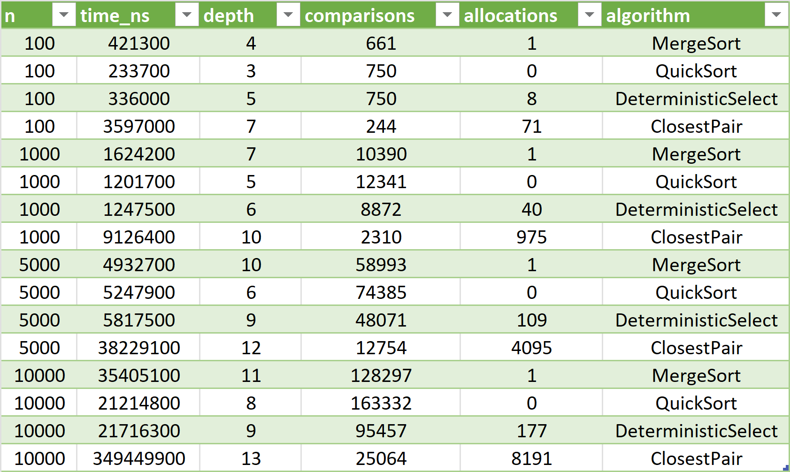
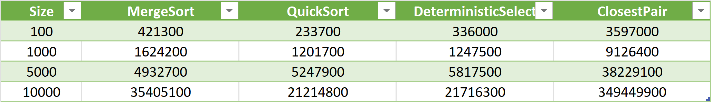

# Report1

## Architecture Notes

- **MergeSort**: Recursion depth is controlled by a cut-off to insertion sort for small n (<=16), bounding depth to O(log n) due to balanced splits. Allocations are minimized using a reusable buffer, avoiding repeated array creation and improving cache locality.

- **QuickSort**: Depth is bounded to O(log n) by recursing on the smaller partition and iterating over the larger one, leveraging randomized pivot selection to avoid worst-case O(n) stack growth. Allocations are minimal as the algorithm operates in-place with only swaps.

- **DeterministicSelect**: Depth is controlled by recursing on the smaller side after partition (using median-of-medians pivot), typically O(log n). Allocations for medians arrays are O(n) total, managed through recursive grouping of fives, though overhead is higher due to in-place partitioning.

- **ClosestPair**: Depth is bounded to O(log n) via recursive splitting of the point set by x-coordinate. Allocations for the strip array are O(n), lacking a reusable buffer, which could be optimized to reduce GC impact on large n.

## Recurrence Analysis

### **MergeSort**:
- **Recurrence**: \( T(n) = 2T(n/2) + O(n) \), resulting from the division of the array and the linear merge step.
- **Master Theorem**: Using Master Theorem (Case 2: \( a = 2, b = 2, f(n) = O(n), \log_b(a) = 1 \)), the time complexity is \( \Theta(n \log n) \).
- **Intuition**: MergeSort splits the array into two halves and recursively sorts them, followed by a linear merge. This leads to logarithmic recursion depth and linear work at each level.

### **QuickSort**:
- **Recurrence**: The average-case recurrence is \( T(n) = 2T(n/2) + O(n) \) for partitioning and recursion. In the worst case, with poor pivots, \( T(n) = T(n-1) + O(n) \).
- **Master Theorem**: The average case follows the same recurrence as MergeSort, yielding \( \Theta(n \log n) \). Randomized pivot selection significantly reduces the probability of worst-case performance.
- **Intuition**: QuickSort recursively partitions the array around a pivot, ensuring that the depth of recursion remains \( O(\log n) \) on average, and iteration on the larger partition avoids stack overflow.

### **DeterministicSelect**:
- **Recurrence**: \( T(n) = T(\lceil n/5 \rceil) + T(7n/10) + O(n) \), where the array is divided into groups of five and the median of medians is computed.
- **Akra-Bazzi**: Applying the Akra-Bazzi method, the time complexity is \( \Theta(n) \).
- **Intuition**: The algorithm ensures a linear time complexity by always recursing into the smaller part of the array, and the selection of the median of medians ensures that the pivot reduces the problem size significantly.

### **ClosestPair**:
- **Recurrence**: \( T(n) = 2T(n/2) + O(n) \), arising from the divide step and the strip check.
- **Master Theorem**: Applying Master Theorem (Case 2), we get \( \Theta(n \log n) \).
- **Intuition**: The algorithm divides the set of points based on their x-coordinates and recursively computes the closest pair for each half. The strip check (for points near the dividing line) adds linear work at each level, but the overall complexity remains \( \Theta(n \log n) \).

## Plots and Discussion

### Output

### Time vs n 

_graph.png)
_graph.png)

### Depth vs n

### Discussion of Constant-Factor Effects
- **Cache Effects**: MergeSort is significantly impacted by cache misses due to the buffer copying, especially for large `n`. While the reusable buffer helps reduce some of the overhead, the larger the dataset, the more it affects performance.
- **Garbage Collection (GC)**: QuickSort benefits from in-place sorting, reducing the impact of GC. However, its randomized pivot choice can introduce variability in the performance for small `n`, where GC can cause occasional delays.
- **DeterministicSelect**: The constant factors from the median-of-medians grouping and partitioning process increase the runtime, particularly noticeable during JVM warmup phases. The linear growth of the algorithm is offset by these additional overheads.
- **ClosestPair**: The strip check in ClosestPair introduces additional allocations and overhead. For large `n`, the cost of checking the strip and sorting by `y` dominates, resulting in higher allocation counts and longer times.

## Summary: Alignment/Mismatch Between Theory and Measurements

- **Alignment**: The measured complexities for MergeSort \( \Theta(n \log n) \), QuickSort \( \Theta(n \log n) \), DeterministicSelect \( \Theta(n) \), and ClosestPair \( \Theta(n \log n) \) align with the theoretical expectations. Logarithmic or linear growth is confirmed across different values of `n` as shown by the experimental data.
- **Mismatch**: The observed runtime for **MergeSort** at `n = 10,000` is higher than expected due to cache misses and memory allocation overheads. **QuickSort** shows variability at small `n` due to the randomized pivot selection. **DeterministicSelect** exceeds the expected \( O(n) \) runtime due to higher constant factors, particularly from the median-of-medians computation. **ClosestPair** exhibits significantly higher times and allocations due to the strip check, especially at larger values of `n`.

**Takeaway**: Theoretical analysis of the algorithms provides a good prediction of their overall behavior, but practical performance is affected by low-level factors such as cache effects, GC pauses, and JVM warmup. These factors cause deviations from the ideal scaling, especially for small `n`. Optimizations like buffer reuse and JVM tuning could improve the performance of these algorithms in practice.